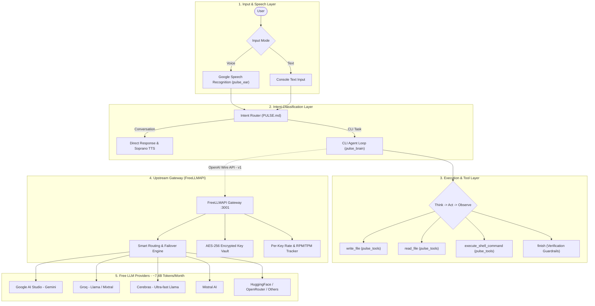

# Pulse CLI Agent

<div align="center">

**Autonomous Terminal Agent with Theoretically Infinite LLM Inference**

[](LICENSE)
[](https://www.python.org/downloads/)
[](https://github.com/tashfeenahmed/freellmapi)

</div>

---

## Overview

**Pulse CLI** is a specialized, autonomous command-line agent designed to translate natural language goals into verified terminal actions. Extracted from the larger **PulseAI** personal assistant ecosystem, Pulse CLI acts as an intelligent pair programmer and shell executor directly on your host machine.

Pulse CLI operates with **theoretically infinite tokens** by coupling directly with [**FreeLLMAPI**](https://github.com/tashfeenahmed/freellmapi) — a local AI gateway that aggregates free tiers across **34+ AI providers** (~7.4 billion free tokens/month across 635+ model endpoints) with smart routing and automatic rate-limit failovers. When one provider hits a rate limit or cooldown, requests seamlessly shift to another free tier, providing uninterrupted autonomous task execution without API bills.

### Key Capabilities
- 🎯 **Dual Intent Architecture**: Intelligently classifies requests into general conversation or autonomous CLI tasks via `PULSE.md`.
- 🔄 **Think-Act-Observe Loop**: Methodically reasons through tasks, breaks them down into discrete operations, observes tool output, and adapts dynamically.
- 🛡️ **Autonomous Verification Guardrails**: Enforces that newly written scripts or programs must be executed and verified before concluding a task.
- 📁 **Native File I/O Tools**: Dedicated UTF-8 file creation (`write_file`) and inspection (`read_file`) primitives eliminate messy shell piping.
- 🎤 **Voice & Text Dual Input**: Supports both hands-free voice commands (Google Speech Recognition) and conventional text input.
- 🔊 **Local Spoken Feedback**: Integrated **Soprano TTS** for responsive local speech synthesis.
- ⚡ **Theoretically Infinite Tokens**: Powered by FreeLLMAPI's encrypted multi-provider pooling (Google Gemini, Groq, Cerebras, Mistral, HuggingFace, OpenRouter, and more).

---

## Architecture

Pulse CLI employs a layered architecture separating natural language orchestration from upstream model inference:



### The Autonomous CLI Agent Loop

When a CLI task is detected, Pulse CLI executes a self-correcting agentic loop:
1. **Think**: Evaluates current system state, directory contents, and previous command feedback.
2. **Act**: Issues a structured JSON action:
   - `write_file`: Safely writes code/config files to disk with UTF-8 encoding.
   - `read_file`: Inspects existing code, configuration files, or logs.
   - `execute_shell_command`: Runs terminal commands, tests, or system utilities.
   - `finish`: Concludes the task once verification criteria are met.
3. **Observe**: Captures standard output, standard error, and exit codes.
4. **Verify**: If errors occur, the agent reflects on the error message, edits the file, and re-tests. The agent is blocked from calling `finish` if errors are unaddressed or files remain unexecuted.

---

## System Requirements

### Hardware
- **Operating System**: Windows 10/11, macOS, or Linux (Ubuntu, Debian, Fedora, Arch).
- **RAM**: 4GB minimum (8GB+ recommended).
- **Storage**: ~500MB for Pulse CLI dependencies.
- **Audio**: Microphone (for Voice Mode) and speakers/headphones (for Soprano TTS).

### Software Prerequisites
- **Python**: 3.10 or higher.
- **Docker & Docker Compose** (Recommended for running FreeLLMAPI) OR **Node.js 20+**.
- **Git** installed on your system path.

---

## Setup Guide

Setting up Pulse CLI involves two simple parts:
1. **Setting up FreeLLMAPI** (provides the local OpenAI-compatible inference gateway).
2. **Setting up Pulse CLI** (the terminal agent itself).

---

### Part 1: Setting Up FreeLLMAPI (Dependency)

[**FreeLLMAPI**](https://github.com/tashfeenahmed/freellmapi) aggregates free inference tiers from 34 providers into a single local OpenAI-compatible endpoint (`http://localhost:3001/v1`).

Choose one of the following methods to run FreeLLMAPI:

#### Option A: Docker Compose (Recommended)

Docker is the cleanest cross-platform way to run FreeLLMAPI.

**On Windows (PowerShell):**
```powershell
# 1. Clone the repository
git clone https://github.com/tashfeenahmed/freellmapi.git
cd freellmapi

# 2. Generate a secure 32-byte AES encryption key
$Bytes = New-Object Byte[] 32
[Security.Cryptography.RandomNumberGenerator]::Create().GetBytes($Bytes)
$ENCRYPTION_KEY = -join ($Bytes | ForEach-Object { "{0:x2}" -f $_ })

# 3. Create the .env configuration
"ENCRYPTION_KEY=$ENCRYPTION_KEY`nPORT=3001" | Out-File -Encoding utf8 .env

# 4. Start the container
docker compose up -d
```

**On Linux / macOS (Bash):**
```bash
# 1. Clone the repository
git clone https://github.com/tashfeenahmed/freellmapi.git
cd freellmapi

# 2. Generate key and write .env
ENCRYPTION_KEY="$(openssl rand -hex 32)"
printf "ENCRYPTION_KEY=%s\nPORT=3001\n" "$ENCRYPTION_KEY" > .env

# 3. Start the container
docker compose up -d
```

> **Tip**: You can also use the one-liner script on macOS/Linux:
> ```bash
> curl -fsSL https://freellmapi.co/install.sh | bash
> ```

#### Option B: Windows Desktop Application (.exe)

If you prefer not to use Docker on Windows:
1. Download the latest installer from [FreeLLMAPI Releases](https://github.com/tashfeenahmed/freellmapi/releases/latest).
2. Run the installer and launch the application.
3. The dashboard will automatically start on `http://localhost:3001`.

#### Option C: Local Node.js Development Server

If you have Node.js 20+ and npm:
```bash
git clone https://github.com/tashfeenahmed/freellmapi.git
cd freellmapi
npm install

# On Windows PowerShell:
$ENCRYPTION_KEY = node -e "console.log(require('crypto').randomBytes(32).toString('hex'))"
"ENCRYPTION_KEY=$ENCRYPTION_KEY`nPORT=3001" | Out-File -Encoding utf8 .env

# On Linux/macOS:
ENCRYPTION_KEY="$(node -e 'console.log(require("crypto").randomBytes(32).toString("hex"))')"
printf "ENCRYPTION_KEY=%s\nPORT=3001\n" "$ENCRYPTION_KEY" > .env

npm run dev
```

---

#### Configuring FreeLLMAPI & Adding Free Provider Keys

1. Open your browser to **[http://localhost:3001](http://localhost:3001)**.
2. Click on the **Keys** tab in the top navigation.
3. Add API keys for one or more free providers. FreeLLMAPI will automatically rotate and failover between them:
   - **Google AI Studio**: [aistudio.google.com/app/apikey](https://aistudio.google.com/app/apikey) (Free Gemini 2.0 / 2.5 models, high RPM)
   - **Groq**: [console.groq.com/keys](https://console.groq.com/keys) (Extremely fast inference for Llama 3.3, Mixtral)
   - **Cerebras**: [cloud.cerebras.ai](https://cloud.cerebras.ai) (Ultra-low latency Llama inference)
   - **Mistral AI**: [console.mistral.ai](https://console.mistral.ai) (Free tier access to Mistral Small/Nemo)
   - **OpenRouter**: [openrouter.ai/keys](https://openrouter.ai/keys) (Aggregates multiple free community models)
   - **HuggingFace**: [huggingface.co/settings/tokens](https://huggingface.co/settings/tokens) (Free Serverless Inference API)
4. **Copy your Unified API Key**:
   - In the header of the **Keys** page, you will see your generated **Unified API Key**.
   - Copy this key — you will paste it into Pulse CLI's `.env`.

> [!TIP]
> **Why "Theoretically Infinite Tokens"?**
> Each free provider offers between 500,000 to several million free tokens every day. By stacking keys across 4 to 8 providers, FreeLLMAPI gives you a pool of billions of free tokens per month. When one provider temporarily hits its rate limit (HTTP 429), FreeLLMAPI automatically switches to the next available provider in your chain without interrupting Pulse CLI.

---

### Part 2: Setting Up Pulse CLI

Now that FreeLLMAPI is running, set up Pulse CLI:

#### Step 1: Clone Pulse CLI
```bash
git clone https://github.com/VinayakFTW/pulse_cli.git
cd pulse_cli
```

#### Step 2: Create a Virtual Environment
Using standard Python `venv`:
```bash
# On Windows
python -m venv .venv
.venv\Scripts\activate

# On Linux / macOS
python3 -m venv .venv
source .venv/bin/activate
```

*(Optional: If you use [`uv`](https://docs.astral.sh/uv/): `uv venv && .venv\Scripts\activate`)*

#### Step 3: Install Dependencies
```bash
pip install -r requirements.txt
```

> [!NOTE]
> **Audio Requirements on Linux:**
> If you are on Linux and want to use Voice Mode, install PortAudio development headers before installing PyAudio:
> ```bash
> sudo apt-get update && sudo apt-get install -y portaudio19-dev python3-pyaudio
> ```

#### Step 4: Configure Environment Variables

Create a `.env` file in the root of `pulse_cli` (you can copy `.env.example`):
```bash
# Windows PowerShell
Copy-Item .env.example .env

# Linux / macOS
cp .env.example .env
```

Edit `.env` and fill in your FreeLLMAPI credentials:
```env
# Point to your local FreeLLMAPI instance
OPENAI_API_BASE=http://localhost:3001/v1

# Paste your Unified API Key from the FreeLLMAPI Keys page
OPENAI_API_KEY=your_freellmapi_unified_key_here
```

#### Step 5: Verify the Setup
Test that Pulse CLI can reach FreeLLMAPI:
```bash
python -c "from pulse_brain.llm_interface import load_openai_model; client, _ = load_openai_model(); print('Connection Successful!')"
```
If configured correctly, it will print `Connection Successful!`.

---

## Usage

Start the Pulse CLI assistant:
```bash
python cli_agent.py
```

### 1. Select Input Mode
Upon launching, choose between voice commands and text commands:
```text
Initializing PulseAI...
OpenAI API loaded successfully.

Select Input Mode:
1. Voice Mode (Default)
2. Text Mode
Choice (1/2): 2
```

### 2. Configure Spoken Feedback (TTS)
In text mode, you can enable or disable **Soprano TTS** voice feedback:
```text
Starting in TEXT mode.
Enable spoken responses with Soprano TTS? (Y/n): n
Spoken responses: DISABLED
```

### 3. Example Interactions

#### Scenario A: Autonomous Code Creation & Verification
```text
Vinayak (Text): create a python script that solves the quadratic equation for a=1, b=-5, c=6, and run it

Tool command received: [TOOL: cli_agent, task: create and run a python script to solve the quadratic equation for a=1, b=-5, c=6]
CLI Agent Activated. Task: create and run a python script to solve the quadratic equation for a=1, b=-5, c=6
Thinking (Step 1)...
CLI Agent Thought: I will write a python script using write_file to compute the roots of the quadratic equation.
CLI Agent Observation: File 'quadratic.py' written successfully (284 characters).

Thinking (Step 2)...
CLI Agent Thought: Now I must execute the script and verify the calculated roots.
Running command: python quadratic.py
CLI Agent Observation: Roots: x1 = 3.0, x2 = 2.0

Thinking (Step 3)...
CLI Agent Thought: The script ran successfully and produced the correct roots (3.0 and 2.0). Verification complete.
CLI Task Complete.
Executed tool: cli_agent
Result: CLI task finished.
```

#### Scenario B: General Conversation / Concept Explanation
```text
Vinayak (Text): what is the difference between TCP and UDP?

PulseAI (openai): TCP is connection-oriented and ensures reliable, ordered packet delivery with error-checking and flow control (used in web browsing and email). UDP is connectionless and sends packets without delivery guarantees, offering significantly lower latency (ideal for video streaming and online gaming).
```

#### Scenario C: System Diagnostics & Exploration
```text
Vinayak (Text): list all files in the current directory and check disk space
```
Pulse CLI creates and executes the appropriate platform-specific commands (`dir` or `ls`, `df` or PowerShell storage cmdlets), reads the output, and reports back.

---

## Project Structure

```text
pulse_cli/
├── cli_agent.py              # Main application entry point & interactive shell
├── PULSE.md                  # Unified system prompt specifications (Router & CLI Agent)
├── conversation_history.json # Persistent session conversation logs
├── pulse_brain/              # Agent reasoning and LLM interface
│   ├── brain.py              # Autonomous Think-Act-Observe loop & verification guardrails
│   └── llm_interface.py      # OpenAI-compatible API client & tool dispatcher
├── pulse_config/             # Configuration & prompt loaders
│   └── config.py             # Environment loader, PromptManager, and history management
├── pulse_ear/                # Voice processing and speech synthesis
│   └── speech_handler.py     # SpeechRecognition and Soprano TTS engine
├── pulse_tools/              # Host tools executed by the agent
│   └── general_tools.py      # write_file, read_file, and execute_shell_command
├── requirements.txt          # Python runtime dependencies
├── pyproject.toml            # Project metadata and tool definitions
├── .env.example              # Template environment configuration
└── .gitignore                # Git exclusions
```

---

## How It Works

### 1. Intent Routing (`PULSE.md`)
User input is first evaluated by the **Router System Prompt**. The router distinguishes between conversational queries and practical tasks:
- **Conversation**: Answered directly by the LLM.
- **CLI Agent Task**: Emits `[TOOL: cli_agent, task: <description>]`, handing off execution to the autonomous loop.

### 2. Autonomous Guardrails
In `pulse_brain/brain.py`, several guardrails ensure reliability:
- **Execution Mandate**: If an agent writes a script with `write_file`, it is prohibited from terminating via `finish` until it has executed the script using `execute_shell_command` and verified the output.
- **Error Recovery**: If a shell command exits with an error code or exception, the agent is notified via `Tool Output` and must formulate a fix before finishing.
- **Step Limit**: Tasks are limited to 10 autonomous iterations to prevent runaway loops.

---

## Troubleshooting

### 1. FreeLLMAPI Connection Issues
**Error**: `CRITICAL: Failed to load OpenAI API: Connection refused` or `Cannot connect to host localhost:3001`
- **Cause**: FreeLLMAPI is not running, or is listening on a different port.
- **Solution**:
  1. Verify FreeLLMAPI is running: visit `http://localhost:3001` in your browser.
  2. If using Docker, check container status: `docker ps`.
  3. Ensure `OPENAI_API_BASE` in `.env` is set to `http://localhost:3001/v1` (the `/v1` suffix is required).

### 2. 401 Unauthorized / Invalid Key
**Error**: `OpenAI Error: 401 Unauthorized`
- **Cause**: The `OPENAI_API_KEY` in `.env` does not match the Unified API Key shown on FreeLLMAPI's Keys page.
- **Solution**: Copy the Unified API Key from the top-right header of `http://localhost:3001` into your `.env`.

### 3. Provider Rate Limits & Cooldowns
**Error**: `All providers exhausted` or slow responses
- **Cause**: The free providers you added in FreeLLMAPI are hitting temporary rate limits.
- **Solution**: Open `http://localhost:3001`, go to the **Keys** page, and add additional free providers (e.g. add Groq, Cerebras, and Google AI Studio simultaneously). FreeLLMAPI will distribute requests across all active keys.

### 4. Voice Mode / Microphone Issues
**Error**: `Speech recognition could not understand audio` or `PyAudio error`
- **Solution**:
  - Ensure a default input microphone is selected in your OS settings.
  - On Windows: Check Privacy settings > Allow apps to access your microphone.
  - On Linux: Ensure `portaudio19-dev` and `python3-pyaudio` are installed.
  - Alternatively, choose **Text Mode** (Option 2) at startup.

### 5. Running FreeLLMAPI in Docker from WSL or LAN
- If running FreeLLMAPI on Docker and accessing it across machines or WSL, start the container with `HOST_BIND=0.0.0.0`:
  ```bash
  HOST_BIND=0.0.0.0 docker compose up -d
  ```

---

## Contributing

Contributions to Pulse CLI are welcome! Please feel free to open issues, submit pull requests, or propose new agent capabilities.

1. Fork the repository
2. Create your feature branch (`git checkout -b feature/amazing-feature`)
3. Commit your changes (`git commit -m 'Add amazing feature'`)
4. Push to the branch (`git push origin feature/amazing-feature`)
5. Open a Pull Request

---

## License

Distributed under the MIT License. See [LICENSE](LICENSE) for more details.

---

## Roadmap

### 1. Skills & Core Capabilities Integration
- [ ] Define modular skill interface and base class schema
- [ ] Implement local capability registry and dynamic discovery
- [ ] Add tool-use parsing and parameter validation logic
- [ ] Implement skill memory, execution tracing, and error handling

### 2. WhatsApp API Integration
- [ ] Set up WhatsApp API & webhook endpoint
- [ ] Implement incoming message webhook receiver and signature verification
- [ ] Add media/text parser for WhatsApp payloads
- [ ] Implement session manager for mapping chat IDs to conversation state
- [ ] Build outbound message formatting and delivery dispatch

### 3. Model Context Protocol (MCP) Integration
- [ ] Implement MCP Client protocol layer (stdio & SSE transports)
- [ ] Build MCP server configuration manager (`mcp_config.json`)
- [ ] Implement tool and resource discovery from connected MCP servers
- [ ] Connect filesystem, web-search, and custom database MCP servers
- [ ] Map MCP tool schemas directly to LLM runtime execution pipeline

### 4. Agent Swarming & Orchestration
- [ ] Define multi-agent roles, system prompts, and individual tool allocations
- [ ] Implement handoff/routing protocol for delegating subtasks
- [ ] Build shared blackboard/state memory for cross-agent collaboration
- [ ] Implement swarm consensus, aggregation, and final synthesis engine
- [ ] Add cycle-detection and execution guardrails across swarm nodes


## Acknowledgments

- [**FreeLLMAPI**](https://github.com/tashfeenahmed/freellmapi) by Tashfeen Ahmed for the free multi-provider LLM gateway and quota management.
- [**Soprano TTS**](https://github.com/) for local speech synthesis.
- [**SpeechRecognition**](https://github.com/Uberi/speech_recognition) for speech input.
- Meta, Google, Groq, Cerebras, and Mistral for making their models accessible via developer free tiers.
